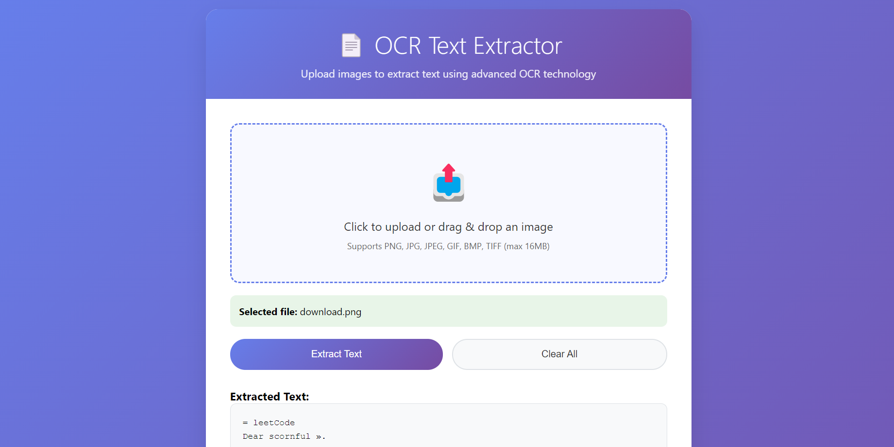

# OCR Text Extractor

A modern web application for extracting text from images using Optical Character Recognition (OCR) technology. Built with Flask and Tesseract OCR, featuring a beautiful responsive interface and both single and batch processing capabilities.

## Link:
- Web-Ocr can be found at [Web-Ocr](https://web-ocr.up.railway.app)

## Features

- **Single Image Processing**: Upload and extract text from individual images
- **Batch Processing**: Process multiple images simultaneously
- **Modern UI**: Beautiful gradient design with smooth animations
- **Drag & Drop**: Intuitive file upload with drag and drop support
- **Multiple Formats**: Supports PNG, JPG, JPEG, GIF, BMP, and TIFF files
- **Text Management**: Copy extracted text to clipboard or download as TXT file
- **Error Handling**: Comprehensive error handling with user-friendly messages
- **Health Check**: Built-in service health monitoring

## Demo

![OCR Text Extractor Screenshot]

## Project Structure

```
ocr-text-extractor/
├── app.py                 # Main Flask application
├── requirements.txt       # Python dependencies
├── Procfile              # Deployment configuration
├── railway.toml          # Railway deployment settings
├── README.md             # This file
├── templates/
│   └── index.html        # Main HTML template
└── static/
    ├── css/
    │   └── styles.css    # Application styles
    └── js/
        └── script.js     # Frontend JavaScript
```

## API Endpoints

### Health Check
- **GET** `/health`
- Returns service status

### Single Image Processing
- **POST** `/extract-text`
- **Form Data**: `image` (file)
- **Response**: JSON with extracted text

### Batch Processing
- **POST** `/extract-text-batch`
- **Form Data**: `images` (multiple files)
- **Response**: JSON with results for all processed images

## Usage

### Single Image Processing

1. Visit the web interface
2. Click the upload area or drag and drop an image
3. Click "Extract Text" to process
4. Copy the extracted text or download as TXT file

### Batch Processing

1. Navigate to the "Batch Processing" section
2. Select multiple images using Ctrl/Cmd + click
3. Click "Extract All Text" to process all images
4. View results for each processed image

## Configuration

### File Limits
- Maximum file size: 16MB
- Supported formats: PNG, JPG, JPEG, GIF, BMP, TIFF

### Tesseract Configuration
The application uses Tesseract with the following configuration:
- OCR Engine Mode: 3 (Default)
- Page Segmentation Mode: 6 (Uniform block of text)

## Dependencies

### Python Packages
- **Flask**: Web framework
- **Flask-CORS**: Cross-origin resource sharing
- **pytesseract**: Python wrapper for Tesseract OCR
- **Pillow**: Image processing library
- **gunicorn**: WSGI HTTP server

### System Dependencies
- **Tesseract OCR**: OCR engine
- **tesseract-ocr-eng**: English language data

## Contributing

1. Fork the repository
2. Create a feature branch (`git checkout -b feature/new-feature`)
3. Commit your changes (`git commit -am 'Add new feature'`)
4. Push to the branch (`git push origin feature/new-feature`)
5. Create a Pull Request

## License

This project is licensed under the MIT License - see the [LICENSE](LICENSE) file for details.

## Acknowledgments

- [Tesseract OCR](https://github.com/tesseract-ocr/tesseract) - OCR engine
- [Flask](https://flask.palletsprojects.com/) - Web framework
- [Pillow](https://pillow.readthedocs.io/) - Image processing

## Support

If you encounter any issues or have questions, please [open an issue](https://github.com/yourusername/ocr-text-extractor/issues) on GitHub.

---